# Mood Swings — Die Stadt der Flummis

[](https://github.com/bmachek/MoodSwings/actions/workflows/ci.yml)

An open-world sandbox about being rude to strangers, built in Rust with Bevy.

Everything here is made of rubber. You do not walk, you bounce; so does
everybody else, and so do the cars. There are no weapons — the two mouse
buttons blow a raspberry and whistle — and nobody can be hurt, because there is
no health to take away. What there is instead is a mood. Every citizen carries
one, wears it as a face, says it out loud, and catches it off the neighbours,
and the whole game is what happens when you push a street's mood around and it
pushes back.

An original work, not affiliated with anyone: the city, the vehicles and the
crowd are all generated procedurally at runtime, and no trademarks or
third-party IP are used. Every face is painted per texel. Every sound is a
CC0 — public domain — recording, fetched by a script and never checked in,
held to the bank's rules mechanically at load; the surface materials are
scanned PBR sets under the same licence.

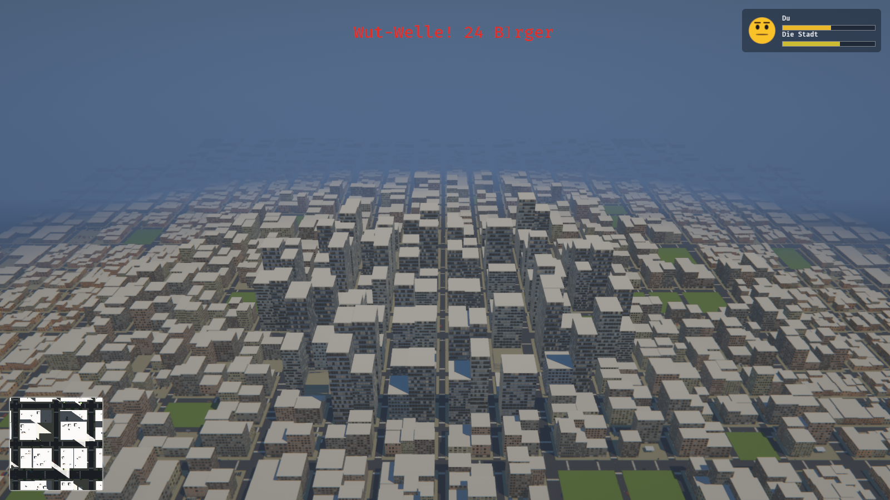

A 2 km² city — 676 blocks, 4046 buildings, 729 intersections — generated from a
seed in 0.3 ms. Districts, parks and the street grid all fall out of the same
generator; nothing here is authored by hand.

| | |
|---|---|
| 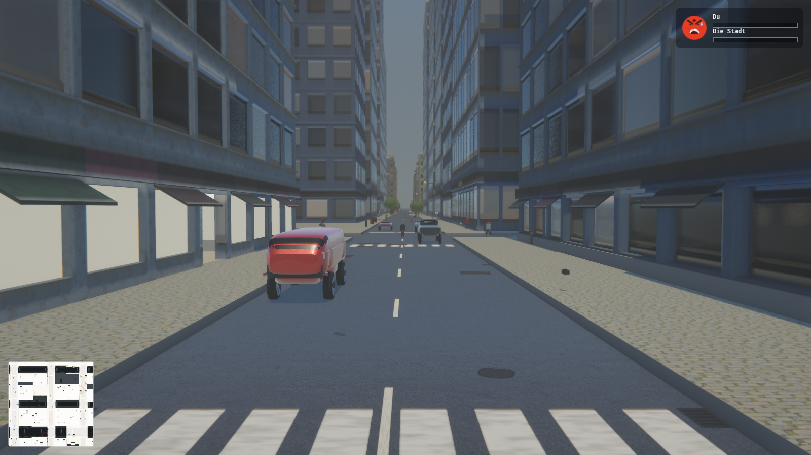 | 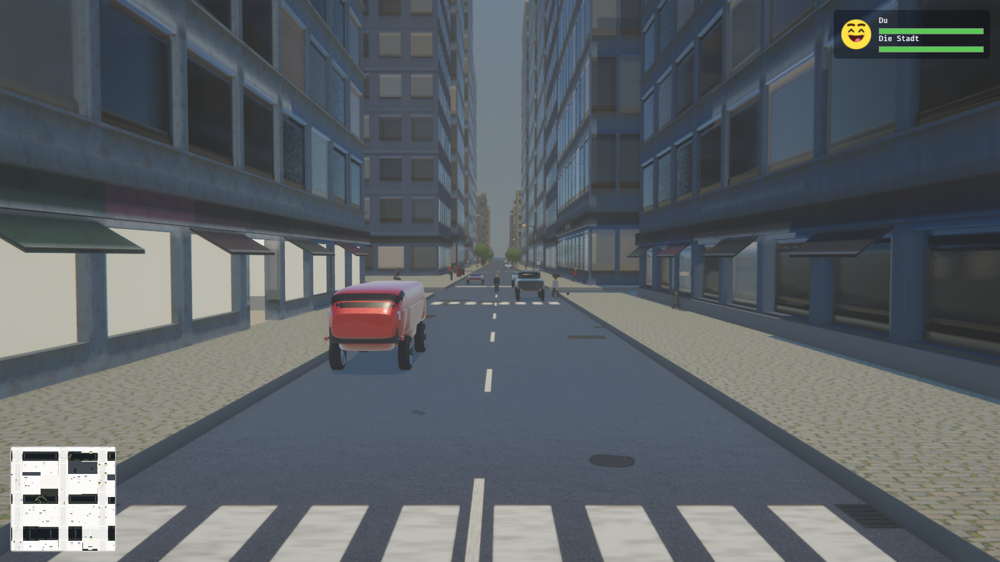 |
| 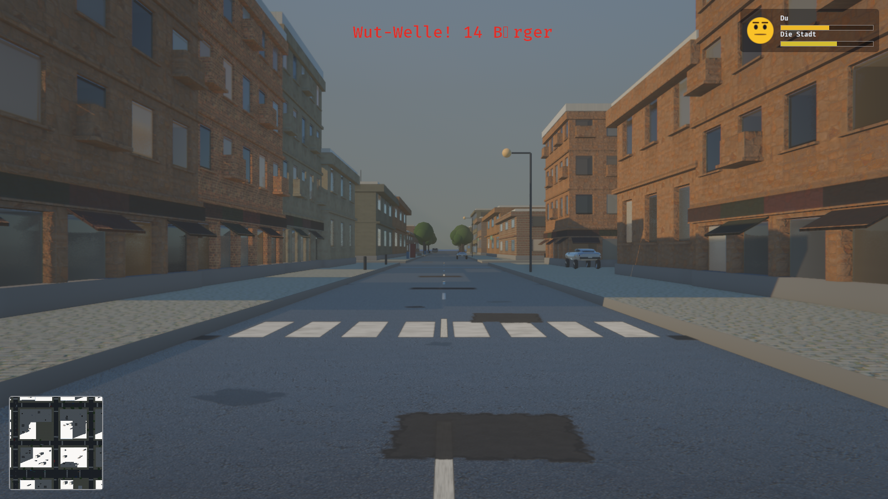 | 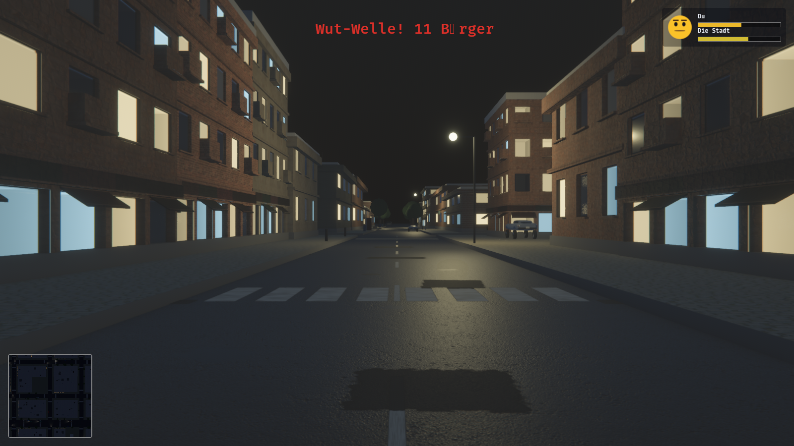 |
| 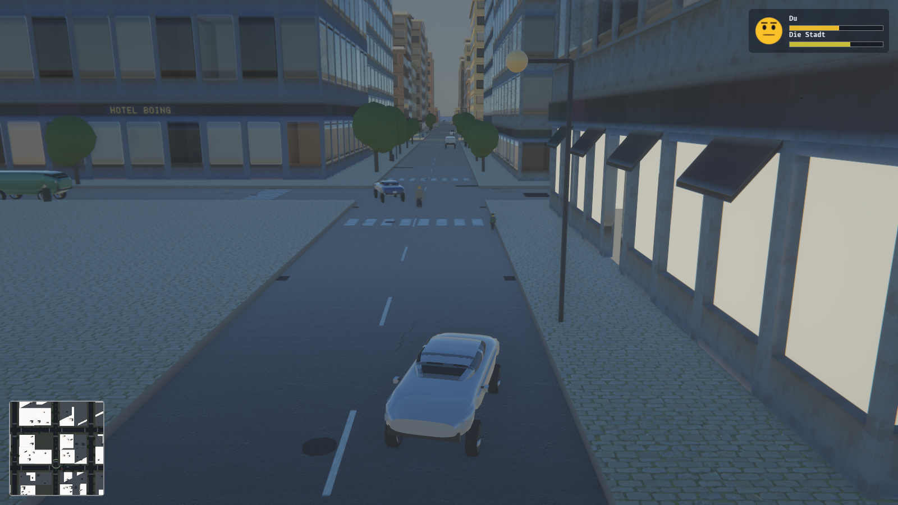 | 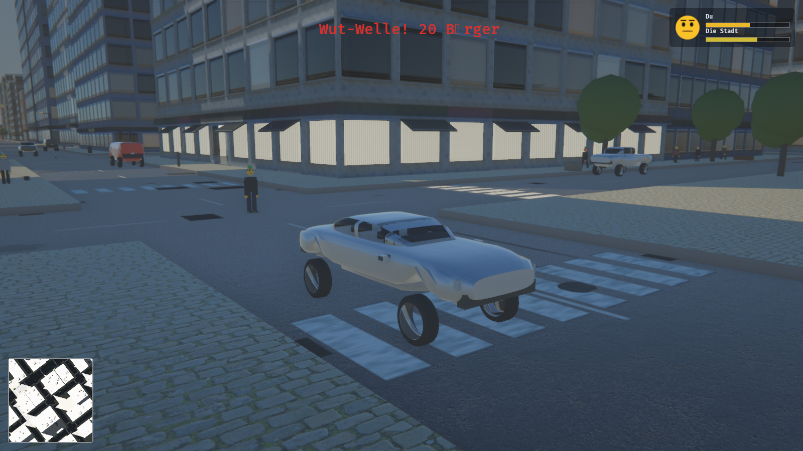 |
| 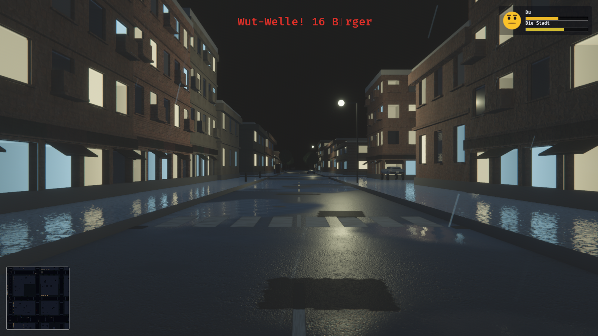 |  |

| | | |
|---|---|---|
| 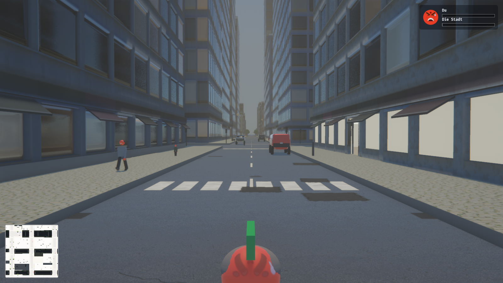 | 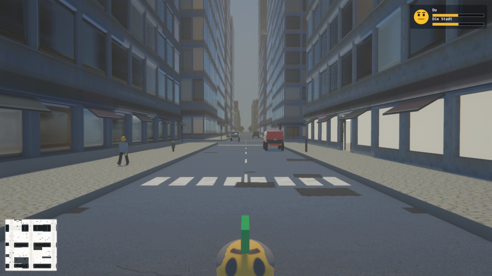 | 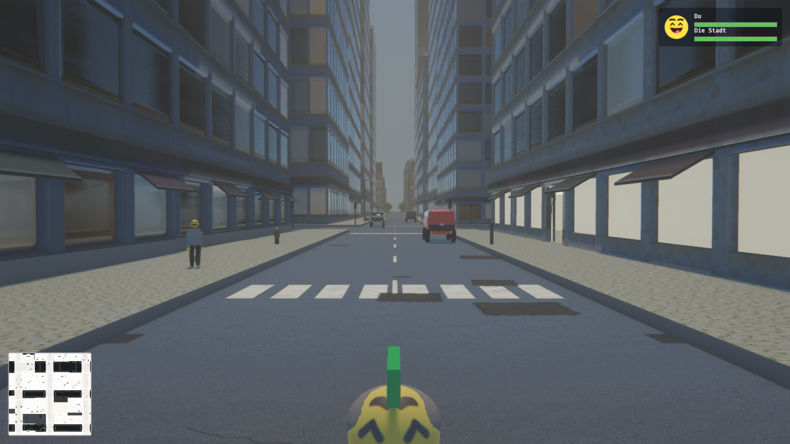 |

## Running

```sh
tools/fetch-materials.sh  # ~200 MB of CC0 textures; optional, see below
cargo run                 # first build takes a few minutes; then ~2-10s
cargo run --release       # smoother, slower to compile
cargo run --features dev  # dynamic linking, fastest iteration
```

The material download is optional. Without it every surface falls back to the
procedural texture it shipped with, and the game runs exactly the same — it
just looks worse. Nothing is checked in and nothing is required to build.

## Controls

| | |
|---|---|
| **WASD** | Move / steer |
| **Mouse** | Look |
| **Shift** | Sprint |
| **Space** | Jump on foot, handbrake in a car |
| **F** | Enter / exit vehicle |
| **Left mouse** | Taunt — a raspberry, and everybody in earshot takes it personally |
| **Right mouse** | Cheer — a whistle, which does the opposite and carries further |
| **Middle mouse** | Apologise — throw a flower at whoever holds a grudge against you |
| **M** | Full-screen map |
| **F1** | Free-fly debug camera (hold right mouse to look) |
| **F5 / F9** | Quick save / quick load |
| **Escape** | Pause menu — save, load, settings, key bindings |

Take your hand off the mouse and the camera swings itself in behind you — hard
behind a car, gently on foot, and never while you are already steering the view
yourself. Both rates are on the dev panel.

Every key above except WASD and the mouse can be rebound from the pause
menu's "Tastenbelegung" screen, along with mouse sensitivity, a Y-invert
toggle, audio and graphics. Settings persist to `saves/options.ron`; the
world state from a save goes to `saves/quicksave.ron`, same as before.

Gamepad is mapped throughout: left stick moves, right stick looks, A jumps,
Y interacts, right trigger taunts, left trigger cheers, X throws the flower,
B is the handbrake.

The menu and the HUD speak German. Everything a developer reads — the dev
panel, the log, the code — is English.

## The loop

There isn't one, and that is deliberate: no objectives, no money, no fail
state, nothing to lose. What there is is a city with a temper, and two buttons
for provoking it.

Blow a raspberry and everybody within about ten metres loses some of their
mood, in proportion to how short their fuse is. Some of them let it go. One in
ten is a Wutbürger who will not: he goes red, remembers who did it, and hops
after you to ram you off your feet, which throws you into the road, which is a
knock hard enough to sour the mood of whoever you land on. Whistle instead and
the same thing runs backwards — a wider circle, a lift rather than a drop, and
a delighted flummi will spin on the spot and go and bump into a neighbour,
which cheers *them* up, because a gentle bop reads as a joke and a hard one
reads as an insult.

Both directions are the same three rules applied to everybody, so the crowd
does this to itself whether or not you are watching. **The HUD shows your own
mood and the city's**, and when enough citizens go red inside one second it
says so.

The rest is a city to bounce around: 857 parked cars to take, a road network
with traffic on it, weather, and a day.

## Layout

| Module | What lives there |
|---|---|
| `core` | States, schedule sets, tunables, persisted settings and key bindings, deterministic RNG, screenshot tool |
| `world` | City generator, road graph, chunk streaming, day/night, weather, lights, facade shells and level of detail, window interiors, walk-in shops and lobbies, drivable parking garages, trees, street furniture, world damage, roofs, road wear, wet roads |
| `bounce` | The elastic simulation: the hop controller, squash and stretch, the boing, being thrown |
| `mood` | How a flummi feels, the face it wears, what it says, and what it does about it |
| `player` | Input mapping, the character controller, camera rig, enter/exit |
| `vehicle` | Arcade vehicle physics, specs, bodywork, comedy crash response, parked-car spawning |
| `ai` | Traffic, pedestrians, shared steering, walk cycles, the figure itself |
| `ui` | HUD, minimap, pause menu, dev tuning panel |
| `save` | RON quick save / load |
| `render` | Quality presets, atmosphere, exposure, bloom, shadows, ambient occlusion, anti-aliasing, volumetrics, grading, the post stack |
| `audio` | The recorded sound bank, the load-time discipline, and what triggers what |

The world is fully reproducible from `GameConfig::world_seed`, so a save stores
only what cannot be derived: the seed, where the player is, and the hour.

## Quality

Everything the renderer is allowed to spend is decided by one preset, resolved
in `render::quality` into a flat block of numbers that the rest of `render`
reads. Five tiers, `low` through `photo`; `high` is the default.

```sh
cargo run                        # high
cargo run -- --screenshot shots/x.png --quality ultra
```

A preset is a *request*, not a promise. At startup the GPU is asked what it
supports and the settings are walked back to fit — asking for raytracing on
hardware with no ray query falls back to screen-space reflections and ambient
occlusion, rather than to a black screen. The dev panel picks a preset live and
lets individual effects be toggled off it, which is the only way to find out
what one of them actually costs.

Raytracing and DLSS are cargo features rather than defaults, because one pulls
in acceleration-structure building and the other needs a vendor SDK:

```sh
cargo run --features raytracing
```

## Development

```sh
cargo test                                  # 402 tests
cargo clippy --all-targets -- -D warnings
cargo fmt
```

### Screenshots without a human

The renderer can be driven headlessly, which is how every milestone was
verified. It renders to an offscreen texture rather than the window, because
capturing a window the OS has not composited returns black.

```sh
cargo run -- --screenshot shots/city.png --at 0,620,900 --look 0,20,-200 \
    --stream-radius 1800 --hour 10

cargo run -- --screenshot shots/street.png --at-node 300 --eye 1.7 --hour 21.5
cargo run -- --screenshot shots/drive.png  --follow --drive --frames 2000
cargo run -- --screenshot shots/map.png    --follow --map
cargo run -- --screenshot shots/rage.png   --frames 240 --mood -1
```

Sound has the same problem and now the same answer. A curse could only be heard
by finding a flummi cross enough to say one, so:

```sh
cargo run -- --audition shots/audio       # the whole bank, one WAV each
```

writes every sound out and exits without starting Bevy at all — loading a
recording never needed an app. It enumerates `audio::bank::REGISTER`, the same
list the loader and the fetch-script sync tests read, so a sound cannot exist
without being auditable, and what it writes is the processed buffer the game
actually plays.

`tools/shoot.sh` renders the whole battery — aerial, street, dusk, night, rain,
dawn, overcast, facade, park, the court, wear, bodywork, showroom, the cast,
geyser, driving, map, the three faces and the street in both moods — so a rendering change can be
judged against the last one rather than against a memory of it. `--all-presets` shoots every
tier into `shots/<preset>/`, and frame times are collected at the end, because
a screenshot says a change looks right and says nothing about whether it can be
afforded.

| Flag | Effect |
|---|---|
| `--at x,y,z` / `--look x,y,z` | Camera pose |
| `--at-node N` | Stand at road junction N, looking down the street |
| `--at-car` | Frame the nearest parked car, three-quarters on |
| `--showroom` | Park one of every vehicle class in a row and shoot it |
| `--lineup` | Stand one of every archetype in a row and shoot it |
| `--geyser` | Shear the nearest hydrant and frame the water (pair with `--frames`) |
| `--wet F` | Soak the ground, 0 to 1 |
| `--cover F` | Cloud over the city, 0 to 1; above about seven tenths it rains |
| `--eye H` | Eye height for `--at-node` |
| `--follow` | Use the real third-person camera |
| `--drive` | Take the nearest car and drive it (also logs telemetry) |
| `--map` | Open the full-screen map |
| `--hour H` | Freeze the clock at hour H, and the weather with it |
| `--stream-radius M` | Load more of the city than a player would |
| `--frames N` | Frames to render before capturing |
| `--quality Q` | Renderer tier: `low`, `medium`, `high`, `ultra`, `photo` |
| `--mood F` | Hold every face in the city at this mood, −1 to 1 |
| `--fps-log` | Log median, p95 and worst frame time alongside the shot |
| `--city S` | Build this `CityStyle` instead of the persisted one (`landshuepf`, `newdork`, …) |
| `--film DIR` | Write a numbered frame into `DIR` instead of one still — see below |
| `--film-every N` / `--film-frames N` | How often to write, and how many |
| `--survey` | Build the layout without a window and print a scorecard instead of a frame — see below; takes `--city` and `--seed N` |

### Filming a run

A still cannot be wrong about a shadow and cannot be wrong about anything that
only happens while the game is *running*: a citizen walking through a wall, a
car climbing a kerb it should have stopped at, a crowd stepping off a kerb in
formation, a chunk popping in. `--film` records instead of posing, and paired
with `--patrol` — which drives the player — it is the game playing itself with
a camera on it:

```sh
cargo run --release -- --screenshot shots/film/unused.png \
    --film shots/film --film-frames 700 --follow --patrol 200 --city landshuepf
ffmpeg -framerate 20 -i shots/film/%05d.png -c:v libx264 -pix_fmt yuv420p out.mp4
```

Frames are written one at a time — encoding a 1600x900 PNG takes longer than a
frame does, so a filmed run plays at about ten a second and the clock is the
game's rather than the recorder's. The first take of this found three defects
in ten minutes, two of which no still framing and no unit test could have seen.

### The survey

A screenshot cannot count. How much of the mapped footprint the bake kept, how
much of a street has a wall along it, whether the ground under every corridor
is still exactly zero — those are numbers, and rendering a frame to guess at
one of them is a minute of GPU for a quarter of the town.

```sh
cargo run -- --survey --city landshuepf            # the committed Landshut
cargo run -- --survey --city landshuepf --seed 7   # another seed's terraces
cargo run -- --survey                              # the persisted city and seed
```

builds exactly what the game builds — atlas, layout, the town's own footprints,
the marcher's terraces, the terrain — and prints one screen of figures in under
half a second, without starting Bevy at all: streets by width and surface, real
buildings against invented ones, the roof mix the map gave, coverage of the
mapped footprint, street-wall closure overall and in the core with the ten
longest unbuilt stretches named and placed, the relief's range and the worst
height under any street. `core::survey`'s tests hold the committed Landshut to
a bar on each of those, so a re-bake that lost a tenth of the Altstadt fails
`cargo test` before anybody shoots it. The survey is the numeric half of
`tools/shoot.sh --town landshut`; run it first, and shoot what moved.

## Licence

GPL-3.0-or-later; the full text is in `LICENSE`. Every sound and every scanned
material the game downloads is CC0 1.0, and the people who recorded them are
named in `CREDITS.md`. `CONTRIBUTING.md` is how to build, test and send a patch.

## Textures

Surfaces come from photogrammetry: `tools/fetch-materials.sh` pulls ten scanned
PBR sets from [ambientCG](https://ambientcg.com), all released under CC0, into
`assets/materials/`. `world::material` loads them — colour through sRGB, the
rest linear — builds each one a mip chain on the CPU, because Bevy has no
runtime mip generator and a 2K texture tiled across a road without one does not
shimmer so much as boil, and hands them a tiling anisotropic sampler.

Anything missing falls back. Every lookup returns an `Option` and the caller
paints its own; a fresh clone with no download still starts.

Structure stays procedural, because no scan can supply it. Every material is
painted into an `Image` at startup by `world::texture` —
value noise, fBm and ridged noise, plus a few deliberate shapes. Facades are
the interesting case: the window grid is drawn per building class (house,
low-rise, mid-rise, tower) so a tower gets curtain-wall glazing and a house
gets four panes and a door, rather than one texture stretched over both.

Each facade produces four maps from one pass — colour, a metallic-roughness
pack so the glass is glossy and the wall is not, a tangent-space normal map so
the panes are genuinely recessed, and an emissive mask marking which windows
are lit. `timeofday` ramps the emissive strength, which is why the city fills
with light at dusk without a single extra light source.

Facades get both. The painted texture holds what is *about* the building —
where the windows are, which are lit, where the floor lines fall — and a
scanned brick or concrete grain is sampled on top of it in **world space**,
through `assets/shaders/facade.wgsl`. Sampling in world space rather than in
the mesh's UV is what makes it work: the grain's scale belongs to the world, so
a two-storey house and a forty-storey tower share one material. Anchoring it to
the building instead would need a size bucket per material and take the city
from twenty-odd draw calls to several hundred.

Variety comes from combination rather than from count. Each district names four
walls — a residential street is brick, brick, older brick and render; an
industrial one is concrete with brick warehouses in it — and each is then
dressed at a different scale, with half turned a quarter turn. Scale is the
strongest lever, because what the eye measures is the course height against the
storey. All of it lands in a material that had to exist anyway, so the city's
material count does not move.

The shader picks one projection rather than blending three. Every wall in this
city stands on the street grid, so the dominant axis of the normal *is* the
plane the wall lies in — there is no diagonal face for a triplanar blend's
seams to show up on. Glass is masked out by metalness, which the facade's own
surface map already carries.

## People

A pedestrian was a capsule, which reads as a person at fifty metres and as a
bollard at five — and five metres is where pedestrians matter, because the
whole game is standing next to one and finding out what it thinks of you. They
are now figures: torso, head, two arms, two legs, hung off the same entity the
capsule collider is still on. Nothing about the physics changed.

Limbs pivot at the joint rather than at their centre, which is why each is an
entity at the shoulder or hip with its mesh hung below it — rotating a centred
capsule swings it about its middle, and a leg that does that is not walking.
The stride is paced by distance covered rather than by time, so running takes
faster steps instead of longer ones. The player wears the same figure.

Skin is not cloth. At roughness 0.88 — as matte as a wool coat — it takes no
highlight at all, which was most of why a figure read as a mannequin, so
anything bare is mixed at a half-gloss instead. Nobody here has a skin *tone*,
though: a flummi's complexion is its mood, so the hands take the same colour
the face does and go red with it. There is also a hair cap, and shoes on the
ends of the legs. All of it is silhouette work — at the distance a pedestrian
is actually seen, a head that ends in a shape and a sleeve that ends in
something are worth more than anything happening on the surfaces. Every
proportion is checked at compile time against the collider capsule, because a
figure that pokes out of its own collider is one whose head can be looked
straight through.

## Bounce

Restitution is a property of a *contact*, and that one sentence decided the
shape of this whole module. The player used to move on a floating character
controller — a spring holds the body a fixed distance above the ground, which
solves kerbs and stairs and slopes for free — and a body held off the ground by
a spring never touches anything. It could be declared as elastic as you liked
and would still land like a sack. Cars have the same problem for the same
reason: they ride on four raycast springs, so their box does not touch the road
either.

So the hop is applied by hand. A ray finds the ground, and at the bottom of
each arc the vertical speed is *assigned* rather than added to — which is what
stops the solver's own restitution and this system compounding into a body that
climbs out of the world. Whatever the last bounce gave back, the next hop
leaves at the same speed, so a flummi crossing a flat street keeps a steady
rhythm and one thrown off a roof still lands like rubber.

The ground probe deliberately reaches well past the soles. A bouncing body is
airborne for most of its cycle, and a controller that only steers while
strictly touching the ground gives you about three frames of control a second.
Reaching down means the lower part of every arc counts as grounded, which is
where the steering that matters happens anyway.

What actually sells it is not the physics but the squash: flattened at the
bottom of the arc, drawn out along the direction of travel on the way up and
down, back to itself at the top. It is the oldest trick in animation and it is
worth more here than any amount of solver tuning, because the bounce the eye
believes is the one it can see the body preparing for. It cannot be applied to
the body entity — Avian scales a collider by its transform, so a figure
flattening at the bottom of a hop would flatten its own collider and sink
through the pavement — so every part of a figure carries its rest pose and is
scaled off that instead.

Being hit by a car is an event rather than a collision. With a ton and a half
arriving at 20 m/s against a capsule that is actively held upright, the solver
loses: the capsule ends up *inside* the bodywork, where it is carried along by a
car it cannot leave. So a car that connects throws you clear and takes the
controller off you for a moment, so the throw lands instead of being braked
away in two frames. Underneath that sits a net that pulls anybody out of a car
they have somehow ended up inside, which makes the bug impossible rather than
merely unlikely. Nobody is hurt; there is no health in this city. They are
launched, and they bounce.

## Faces

Every head is an emoji, and none of them came from a font. A font would have
been the only piece of third-party art in a project that paints its own bricks,
and — worse — it can only hand back the moods somebody else drew. A mood here
is a continuum and the face has to sit anywhere on it, including all the places
between 😠 and 😐 where most of the comedy lives.

So the face is a function of one number. The complexion goes red-hot at one end
and bright yellow at the other; the brows tilt in and drop at the nose, or lift
and bow; the eyes narrow to slits or open into round pupils or curl up into two
arcs; the mouth is one lens shape whose curvature changes sign at exactly
neutral, so an indifferent flummi gets a flat line. At the furious end there is
a flush on the cheeks, a vein between the brows and a bead of sweat at the
temple.

Two things here were derived rather than guessed, and both are the kind of
detail that would otherwise be tuned by eye forever. Bevy's UV sphere stands its
poles on **±Z**, not ±Y — the stack angle drives the third component of each
vertex — so left alone the pole singularity lands exactly where the face goes,
since a figure faces its local −Z. The head mesh is turned a quarter turn about
X, which stands the poles up where a head's poles belong and brings the
equator's `u = 0.25` round to the front. And the painter bails early outside a
box, so most of a sphere that is mostly not face costs one comparison; that is
only safe because a test goes and measures how far the outermost feature
actually reaches at every mood. A clipped brow would be a hard straight line
nobody would catch by squinting at a head 13 cm across.

Repainting a 256² texture whenever a mood moves would be a texture upload per
flummi per frame, so the scale is quantised to thirteen levels, each with its
own texture and material baked at startup — about 130 ms, and 4 MB. A figure
whose level changes swaps a material handle and nothing else. The same thirteen
moods are painted a second time flat and cut out, at 96², for the portrait in
the corner of the HUD: cropping the head texture would mean blowing a 38-pixel
window up to twice its size.

## Voices

The flummis talk, and what they say is nothing at all. Gibberish is a decision
rather than a shortcut — a rising pair of syllables is a question and a falling
growl is a complaint in any language, so the tone carries the whole message,
and made-up words cannot be misheard as a real insult, which matters in a game
whose entire subject is people being rude to each other.

The voices used to be synthesised — a Rosenberg glottal pulse through three
formant band-passes, a genuinely lovely instrument — and they were retired
with the rest of the synthesis, because the recordings simply land better.
What speaks now is real people under CC0: a giggle, three flavours of
frustrated groan for the grumbles, three angry wordless grunts for the
curses, a gasp, and human whistling for the cheer. Wordlessness survived the
change of instrument: tone carries the whole message, and made-up noises
cannot be misheard as a real insult. Every take is still pitched per speaker
at playback, so a citizen sounds like themselves every time — and so one
recorded human becomes forty different flummis rather than the same person
forty times.

Deciding *who* speaks turned out to be the harder half, and the obvious limit
is the wrong one. Capping the choir at the nearest few does nothing on its own:
the ones outside it become eligible a frame later, the street cycles through in
a tenth of a second, and the city ends up saying something ten times a second.
A per-flummi rest stops one citizen hogging the conversation and does nothing
about forty of them taking turns. So the city as a whole takes turns too, and
the nearest-few cap becomes what it should have been from the start — a rule
about who is worth hearing rather than about how often.

## Tempers

A mood is one number between −1 and +1. Two things move it: what happens to a
flummi, and what is happening to the flummis around it. The second is the
important one — a city where every citizen sulks privately is forty-five
unrelated sulks, whereas one where a mood spreads is a crowd.

The disposition doing the reacting is per citizen rather than global, which is
what makes the same shove funny twice: it bounces off one flummi and starts a
feud with the one standing next to it. Five of them, and the mix is weighted
rather than uniform, because a city that is a fifth Wutbürger is one where the
joke never lands — a shove has to bounce off somebody most of the time for it
to be funny when it does not.

| | Baseline | Fuse | Recovery | Contagion | Grudge | Share |
|---|---|---|---|---|---|---|
| **Serene** | +0.55 | 0.20 | 0.55 | 0.15 | 0.02 | 15% |
| **Easygoing** | +0.30 | 0.40 | 0.40 | 0.30 | 0.10 | 25% |
| **Ordinary** | +0.05 | 0.65 | 0.28 | 0.45 | 0.30 | 30% |
| **Touchy** | −0.15 | 0.95 | 0.18 | 0.60 | 0.60 | 20% |
| **Ragemonger** | −0.45 | 1.40 | 0.08 | 0.80 | 0.95 | 10% |

The joke lives on one line. A knock below about six and a half metres a second
of lost velocity is a friendly bop and cheers most people up; above it, it is an
insult that lands in proportion to the fuse. And a fuse short enough turns even
the bop sour — which is precisely what a Wutbürger is, and it falls out of the
arithmetic rather than being a special case.

Everything is drawn from its own RNG stream. Sharing the pedestrian one would
have meant that retuning a fuse also moved where the next citizen spawned and
which street they walked down, and the whole city is regenerated from its seed
on demand, so that is not a cosmetic problem.

Retaliation is the last rule. Somebody cross enough, with a long enough memory,
picks the offender out of the street and hops after them to ram them off their
feet — which launches the victim, sours their mood, and starts the next one. A
provocation names its author, but a knock does not: it is spotted from a sudden
change in velocity and has no idea what caused it. Rather than plumb a culprit
through the physics, an aggrieved flummi blames *whoever is standing nearest*.
That is wrong about half the time, which is the correct amount — being furious
at the closest available person is what the temperament is for, and a Wutbürger
who correctly blamed the wall would be a much duller neighbour.

The happy half is the same collision with a different number on it. A delighted
flummi pirouettes into its neighbour, the bump reads as a bop, and both moods
go up. Two contagions running in opposite directions out of one contact, and
the five dispositions are sliders on the dev panel so the balance between them
can be found by pushing rather than by arguing.

## Queues

A city where nobody ever has to wait for anything is not a city, it is a lobby.
Citizens had somewhere to go — every building above house height puts a
shopfront out on the pavement, and a share of the crowd walks over and goes in
— and the door was the end of it. They arrived, they vanished, and the shop
served an unlimited number of people at once.

Now they queue, and a queue turns out to be the cheapest social structure there
is and the one that carries the most legible intelligence per line of code. It
is **ordered**, so it can be jumped. It is **shared**, so somebody at the back
is being made to wait by somebody at the front they cannot see. It has a
**rate**, so it can be too slow. And everybody in it is standing perfectly
still facing the same way, which is the single most recognisable shape a crowd
ever makes — you read *there is something in there* from across a junction with
no UI at all.

Four rules make it a queue rather than a huddle.

**It runs along the wall.** The direction comes from the shopfront's outward
normal, which is why a front carries one; a line that runs out from the door
stands in the carriageway. Which way *along* is derived from the door's own
identity, so both pavements do not all lean the same way and a queue survives
its chunk streaming out and coming back leaning the way it did before.

**It only advances at the front.** The head is served, goes in — the same
despawn that walking through a door always was, because a body parked inside a
streamed room is a body standing in a field — and everybody shuffles up one.
Nobody in the line decides anything. They follow the person ahead, which is the
whole of what standing in a queue is, and it is why the slow concertina reads so
strongly from a distance. The head faces the door and everybody else faces the
back of the person in front, and that one branch is the entire difference
between a crowd and a queue.

**It can be lost.** Patience is the temperament's fuse crossed with what the
archetype came for, so it runs from about seventeen seconds to about a hundred:
the Wutbürger gives up first and reddest, the flying trader is still there when
the shop shuts. Somebody peeling off the back of a line is the most human thing
the crowd does. The waiting itself is a drain rather than a jolt, and a drain
does not accumulate — it finds a level, at `baseline − sting / recovery` — so
the five dispositions come out of the same queue five different colours without
this module choosing any of them. A serene flummi leaves fractionally less
delighted; a Wutbürger leaves flat on the floor of the scale, at which point the
contagion, the reddened face and the rage wave all happen on their own.

**It can be jumped.** Standing in front of the head is the only thing the player
can do to this city that involves no launching, no taunting and no vehicle, and
it gets a bigger reaction than most of the things that do: the whole line turns
round, the moods drop by the second, and the queue *stops*, because an outrage
that can simply be waited out is not an outrage. There is a grace period first
— a pavement runs past every door in town and walking down it is not a
provocation. The offence is standing there, which is a decision.

The city also does it to itself, which is the half that matters, because it
happens whether or not anybody is watching. Somebody arriving at a door decides
once, on the way over, whether to walk to the back or to the front, and it takes
an archetype with the cheek *and* a mood bad enough to use it — the hooligan,
the Wutbürger, the punk, and Elvis, who is not being rude, he simply does not
believe the queue is about him. The same flummi waits its turn on a good day,
which is what makes it read as a mood rather than as a personality, and most of
the cast never does it at all, because a city where anybody might push in is a
city with no queues in it. They go in at second, never displacing the head —
nobody has ever had the nerve, and it is the real move anyway — and everybody
*behind* them takes the hit and turns to look at them, while the head neither
loses anything nor notices. Which is exactly how it goes.

And one rule that makes it funny rather than merely correct: **a queue
recruits**. One person outside a door is the most persuasive advertisement any
city has ever printed, and passers-by attach themselves to the back of it at a
rate set by how nosy their archetype is, with no idea what is being sold.

Getting that to happen at all took three patrols and an instrument. The
threshold started at *two*, on the sound-sounding ground that one person
outside a shop is not a queue yet, and a patrol killed it. A hundred and fifty
seconds of city never once got two people to the same door at the same moment —
every reading was one person standing in one line — so the threshold was never
crossed and the recruiting never ran at all. Reaching two *is* the coincidence
the lure exists to manufacture, so gating the lure on it gates it on itself. The
failure is invisible from inside the game, which is the whole argument for the
patrol: a city where every door has exactly one customer looks like a city that
is working.

Fixing the threshold changed nothing, because it was not the binding
constraint, and one number could not say what was. So the queues learned to
count what they do — errands handed out, places taken, turns served, people who
gave up — and the patrol prints it. The tally said the city produces about a
sixth of a door-arrival per second across every shopfront in the streamed ring;
by Little's law, at seven seconds a turn, that is one person standing at one
door, which is precisely what every reading had shown. The constants were
working exactly as written.

The fatal number was a ratio nobody had looked at. A recruit eleven to
seventeen metres away walks in at just over a metre a second, so arriving takes
fifteen seconds — and the head was served and gone in four to eleven. *Every*
recruit arrived at an empty door, became a lone head, and was served alone.
Recruiting could never compound, no matter how hard it was tuned. A turn at the
counter now outlasts the walk in, the reach is shorter, and the relationship is
a compile-time assertion rather than two numbers that happen to be compatible
this week. The
headphone-wearer never notices there is a queue at all, which is what headphones
are for and the same joke as their immunity to taunts. The Wutbürger is the
most likely person in the city to join one and the least likely to stay: he does
not want it, he wants to know what he is being kept out of.

A queue is also the one thing the crowd does that has no symptom anywhere else
— somebody standing in a line is not blocked, is not waiting on a give-way, is
not off its route and is not going anywhere — so the dev panel and the patrol
both read the queues directly, and the patrol complains about any line that has
not moved in seventy-five seconds. A single wedged queue outside one shop in a
town of several hundred is exactly the failure a human walks past.

## Signs

Nearly everything this city says, it says on a painted rectangle, and all of
them are drawn with the same hand-made 5×7 alphabet: the shop plaques, the
advertising posters on the blind gable walls, the enamel street-name plates,
the bronze on the park monuments, the scoreboard over the stadium, the number
plates on the cars, the notice beside the hole in the pavement, and the
placards in the parade. One alphabet, one cell geometry, one clamp that shrinks
a long line until it fits — so a town reads as a town rather than as a
collection of modules that each found their own font.

The rule for writing one is the police station's, and it has not changed:
deadpan, plausible, and told entirely in the register of whoever is saying it.
The sign is never in on the joke. `POLIZEI — wegen anhaltender Freundlichkeit
geschlossen` works because a police station would put exactly that notice up,
in exactly that typeface, and mean it.

The shop chains get competitors — three or four plaques a kind, picked by the
building's own seed, so a street reads as several businesses rather than one
monopolist — while the civic kinds stay singular, because there is one Rathaus
and it has exactly one sense of humour. Two quarters override the choice
entirely: every dining room in Klein-Neapel is the Pizzeria and every one in the
Fernost-Viertel is the Wok, which is how real quarters advertise themselves, one
cuisine repeated until it is a neighbourhood.

The posters are where the register does the most work. Every one of them speaks
fluent advertising and says nothing, which is only a slight exaggeration of the
medium, and they are kept gentle on purpose: the city laughs at products, not at
people. The one election poster has a list number and no candidate, because a
list number is nobody.

The parade carries the rest. A march with no signs on it is a queue that
happens to be in the road, and the placards are where a column says what it is
about — twice over. The CSD column means every word of its signs and the words
are about being round, soft and several colours, which is what everybody in this
city already is. The demonstration is furious about municipal street furniture,
because in a town with no weapons, no police and no way to come to harm, the
bollard is the last remaining oppressor and it has never lost an argument.
Every third marcher walks with their hands in their pockets, because a column in
which literally everybody brought a sign reads as a stock photo, and the rest
walk down a run of slogans rather than repeating one — which is the difference
between a demonstration and a chorus line, and it is free.

## Roofs

A building was two boxes: a wall and a capping slab. From the pavement that is
nearly enough, because you cannot see a roof from the pavement. From anywhere
with height it was the most damning view in the game — four thousand identical
white rectangles, a circuit board rather than a skyline.

Two levers, kept separate because they cost completely different things. The
**parapet varies per building** — height and overhang drawn from the building's
own seed. That is free, because the slab was already an entity with its own
transform, and it is the half that still reads from a kilometre up where an
air-conditioning unit is a fraction of a pixel. **Clutter sits on the deck** —
plant, extract stacks, water tanks, the stair head that had to surface
somewhere, an aerial nobody took down. That costs a draw call each, so it
carries a visibility range and stops being drawn well before it stops being
resolvable.

Placement is a coarse grid with jitter inside each cell, sampled without
replacement. Two pieces cannot occupy the same volume whatever the RNG does,
and it terminates in a fixed number of steps rather than in however many tries
overlap-testing needs. The seed comes from the footprint rather than from a
spawn counter, because chunks regenerate whenever the player walks back into
them and a counter would re-roll a different roof each time.

## Facades

Every building was a scaled cube with a facade painted onto it. That carries
further than it sounds — the normal map bevels the panes, the grain shader gives
the wall a material — but it fails in exactly the situation the player is in
most of the time: standing on a pavement looking *along* a street. At a glancing
angle a painted reveal has no parallax and no silhouette, so every window in the
row lies in one plane and the eye reads the whole street as a poster.

So the near wall is geometry: panes set back behind the wall with jambs around
them, sills, string courses at the floor lines, a cornice at the top, a sign
board over the shopfronts with awnings under it, and balconies on the kinds of
building that would have them.

**There is not a single metre in `world::shell`.** A reveal is a fraction of a
*bay*, a course is a fraction of a *storey*, and both come out of the same
`FacadeClass` grid that `world::texture` paints the windows on — one description
of the window grid, read twice, so the reveals cannot land beside the glass. It
is also the whole reason one mesh serves four thousand buildings: the shell is
built in unit-cube space and scaled by the building's own transform, so a length
baked into it comes out multiplied by whatever that building happens to measure.
A twelve-centimetre reveal on a house would be half a metre on a tower.
Expressed as a fraction of a bay it survives the scaling, because a bay is
scaled by the same number.

Anything standing proud of the wall — a sill, a balcony, an awning, the
underside of the cornice — is coloured from a rectangle of facade that is known
to be masonry, not from where it happens to stand. A balcony parapet hangs
across the lower half of its own window, and sampled by position it comes out
glazed: a second pane floating half a metre in front of the real one and
displaced from it by its own parallax. The awning gets the shopfront's sign
board, which is what a real one carries anyway.

Sixteen meshes cover the city: four height classes, two levels of detail, two
variants. Two variants rather than one because a residential street is a row of
buildings of the same class, and a single pattern would put every balcony in it
on the same bay of the same floor.

| Level | Out to | What it is |
|---|---|---|
| LOD0 | 170 m | Reveals, jambs, sills, balconies, awnings, every course |
| LOD1 | 460 m | The horizontal courses only |
| LOD2 | beyond | The chamfered box, and the collider |

Those two numbers used to be eighty and two hundred and fifty, which were tuned
against a grid city. A Landshut street canyon is two hundred metres long and the
view across the Isar is six hundred, so past the first few houses the town *was*
the coarse shell — sixty triangles for a house, a hundred and thirty for a
three-storey block. Everything in `world::shell` was being spent on the two
buildings nearest the camera and thrown away on the four hundred behind them.
It is paid for out of the cast: a pedestrian used to cost about eight and a half
thousand triangles, seven houses' worth, for a figure forty pixels tall.

All three levels carry the same transform and measure from the entity's origin
rather than from a bounding box, so all three measure the *same* distance and
hand over on precisely the same metre — which is what Bevy needs before it will
dither one into the next instead of blinking between them. The facade shader
calls `visibility_range_dither` itself; a custom fragment shader that forgets to
is how a crossfade becomes two solid buildings in the same place.

Shadow casting follows the chain rather than sitting on one level of it, because
Bevy's directional-light visibility honours the same ranges the camera does: a
level culled by distance casts nothing.

The distances are multiplied by the preset's `lod_scale`, and then clamped. The
clamp is a resolution argument rather than a frame budget — at 1440p across a
sixty-degree field a pixel subtends about four ten-thousandths of a radian, so a
two-hundred-millimetre reveal is one pixel wide at five hundred metres and less
than one beyond it. Photo mode is entitled never to drop detail it could see;
that is where it stops being the same sentence.

## Windows

Geometry got the reveal right and left the pane wrong. A window was a flat
colour behind a frame, and a flat colour is the one thing a window is not: what
says *room* is that whatever is behind the glass moves against the frame as you
walk past, and stops when you stop.

So the facade shader follows the view ray into a box behind the glass and shades
whichever of its five surfaces the ray lands on — interior mapping, which is
parallax mapping with a room instead of a height field. No geometry behind the
pane, no second draw, no texture: one ray against six planes, on the fragments
the metallic channel already marks as glass.

Two things it needs to know and had no way to:

* **Where the pane sits in its cell.** It is handed the same `FacadeClass::pane`
  rectangle that `world::texture` painted the glass from and `world::shell` cut
  the reveal from — a third reader of the one description of the window grid,
  rather than a third copy of the numbers.
* **How big the pane is in metres.** One material is shared by every building in
  a district and no two of them are the same size, so nothing in the material
  knows. It is recovered per fragment instead: a wall is planar, so its world
  position is an affine function of its UV, and the screen-space derivatives of
  the two are a two-by-two system whose solution is how many metres a whole
  building face measures. A shopfront then gets a shop-sized room and a bathroom
  window a bathroom-sized one, out of the same uniform.

A third of them have blinds down, which is the cheapest variety there is: a room
you cannot see into still reads as a room, and it reads as a different one from
the room next to it.

The glass stopped being a metal to pay for this. It was one — `metallic 0.55` —
because a metal reflects, and reflecting was the only way to get anything at all
into a window. With a room behind it that trade runs backwards: a metal's base
colour tints its reflection instead of showing through it, so the room would
have come out as a coloured mirror. As a dielectric the glass shows the room
straight on and still mirrors the street at a glancing angle, which is the angle
a window actually reflects anything at.

Lit windows keep the parallax after dark, because the emissive is scaled by the
same surface the ray landed on: a lit room's back wall is brighter than its side
walls, and the two slide against each other as the camera moves.

## Wear

The asphalt is one plane two kilometres across, and its texture is painted
before the street layout exists — so nothing in it can know where a junction is,
where cars stop, or which way the water runs. Manholes, gullies, repairs, oil,
cracks and rubber are laid on top of it afterwards, as forward decals: a quad
that reads the depth prepass, finds the surface actually underneath it, and
projects itself onto that.

That is the difference between `world::decals` and `world::markings` next door,
and the reason they are not the same code. A road marking is an alpha-masked
quad floating a centimetre and a half above the asphalt, and it gets away with
that because paint really is a flat sheet lying on top of a road. A manhole
cover is not: it sits *in* a surface that falls away towards its gutters.

The wear is in the placement rather than in the images:

| | Where |
|---|---|
| Manholes | one line down each street, at the spacing an access chamber is built at |
| Gullies | in the gutter, against both kerbs |
| Patches, cracks, stains | counted per hundred metres, scattered across the carriageway |
| Rubber | on the approach to a junction, in the lane the traffic drives in |
| Oil | where a car waits at that junction |

Two things it costs. A decal draws with its depth test off — that is what lets
it paint a surface that is not exactly where its own quad is — so the only thing
keeping a stain off the roof of the car parked over it is the distance over
which it fades out, which is thirty centimetres. And decals are blended, so they
are sorted, unlike everything else in the city.

Which is what the hundred and thirty metre draw distance is for, and it is what
pays for the density. A street that has been dug up twice and driven over for
twenty years is not a clean sheet with three marks on it, so there are a lot of
these — but a manhole cover is 700mm across, and past a hundred and something
metres it is one pixel that still has to be sorted against every other one. The
count that makes a road look driven on is only affordable if nearly all of it is
never drawn. Like everything else with a range, it scales with the preset.

The failure this technique is prone to is invisible from head height. The
projection pushes a decal's UV outside its own image as the view flattens, and
the sampler clamps rather than wraps, so whatever is in the edge texel gets
dragged across the road for as far as the projection reaches. Every decal is
painted with an exactly transparent border, and a test reads the pixels back to
say so — "nearly zero" is a smear that is nearly there.

## Trees

There was not one. A park was a green rectangle and a residential street was two
rows of boxes with a bin between them.

A tree is two entities: a trunk whose mesh is translated so that the entity's
origin sits on the ground, and one crown as its child. The crown is several
blobs merged into a single mesh at build time — three offset ones for a plane
tree, three stacked for a poplar — because the silhouette is the entire
difference between the species as far as anyone on the pavement can tell, and
merging costs nothing once, per species, at startup.

The trunk pivoting at its foot is what lets the wind work. `Weather::wind`
drives a rotation about the axis perpendicular to it, and the crown comes along
because it is a child: no vertex animation, no custom material. Two sine
frequencies rather than one, because a street of metronomes in step is worse
than no movement at all, and the cycle runs from a third of the lean to all of
it rather than through zero — a gust adds to a lean, it does not reverse it.

How far each species gives is checked against the cantilever it is. Tip
deflection goes as length cubed over the fourth power of the trunk's radius, so
a poplar bends further than a cherry despite the thicker trunk, because it is
twice the height.

Only what the camera can see sways. That is not an optimisation of the maths —
the maths is four sines — but of the *write*: touching `Transform` queues an
entity for transform propagation and a fresh upload of its instance data, and
there are thousands of these standing in chunks nobody is looking at.

A street is either an avenue or it is not, decided once per street rather than
per tree, and it is planted with one species — a row of trees goes in at once,
by one council, from one nursery. Parks get a jittered grid, a clipped hedge
round the edge, and a gap in the middle of each side to walk in through.

Street furniture roughly doubled at the same time: parking meters, benches,
newspaper boxes, planters, phone boxes. Junctions with three or more arms, at
least one of them arterial, get a signal on each approach.

## Landmarks

The city stopped being anonymous in stages. The signs learned German first —
the shared 5×7 font grew umlauts and punctuation, and with them jokes: the
chains compete (HÜPF & GUT against FRISCHE-ECK, HOTEL BOING against PENSION
SORGENFREI), every civic building carries a deadpan subline in its own
institutional register, and the anonymous blocks rent their gables out to a
rotation of eight parody posters. Parks keep monuments — the unknown flummi
(launchable, with enough speed; being launched is this city's honour), the
memorial to the inventor of the bollard (unbreakable, keeping the family
promise), and an empty plinth in progress since 1874 — each with a painted
bronze plaque.

Then came the skyline: churches with naves, towers and four-sided spires;
a museum, schools, market lots with scatterable crates; one stadium whose
seated crowd does die Welle forever over an eternal nil-nil; and a canal —
one street of the grid surrendered to trampoline-elastic water, its kerbs
reading as quays and its crossings as bridges. Two cultural quarters lie
over the middle ring as wedges: Klein-Neapel in terracotta with a mandolin
on the air, the Fernost-Viertel in lacquer and jade with a guzheng, each
forcing its own restaurant chain, which is how real quarters advertise.

And the whole thing answers to a `CityStyle`: the same seed builds
Irgendstadt, Landshüpf (low pastels under the world's tallest brick tower),
New Dork (1.8× heights, twice the advertising), Londoof, Minga (extra
markets) or Paree — chosen in the settings, applied at the next launch.

## Landshut

Landshüpf stopped being a postcard of nowhere. `assets/cities/landshut.ron`
is the real town, and the game builds it as it stands:

- **The streets** are the real ones, off OpenStreetMap, with their names,
  their widths and what they are paved with — the Altstadt in ten-centimetre
  granite Kleinpflaster laid in courses, the Neustadt in slabs. A folded band
  like the market street is centred between its house rows rather than left
  on whichever lane was longest, and every street is capped to what fits
  between its buildings, because a medieval lane is narrower between its
  walls than its lane count implies. The Altstadt is mapped as one closed
  way — up one lane, round the top and down the other — and once both lanes
  are on one centreline that loop is the same street twice, with a pavement
  laid across the carriageway at every turn-round; the bake cuts a looped
  band down to its longest run and puts every side street that met the
  dropped lane back onto the spine as a junction.
- **The buildings** are the real footprints, from the Overture Maps buildings
  theme: each polygon cut at bake time into the rectangles that cover it (an
  L is two, a courtyard block four), so the ring blocks round a courtyard
  exist instead of being thrown away as too ragged for a box. Two thousand
  nine hundred and fifty of them, in four thousand seven hundred parts,
  covering ninety-nine percent of the mapped footprint; the marcher invents
  a house only where the map has none. Roof shapes come with them where
  anybody recorded one.
- **The ground** is the Copernicus elevation model, baked as metres above the
  valley floor. The town stays exactly flat wherever a street runs — that is
  the rule every spawner relies on — and where no street reaches, the
  Hofberg rises seventy metres behind St. Martin, wooded on the face it turns
  to the town, with the castle's wings on one levelled courtyard on top. A
  street the map takes up the hill is left to the hill rather than cut into
  it as a trench.
- **The roofs** are a carpet of steep red tile to the edge of town, and
  drawn to the edge of town: Vorschussmauer screens with an attic storey of
  windows on the Altstadt houses, plain Satteldächer and Walmdächer
  everywhere else, with dormers, chimneys on the ridge, and flat decks only
  on the supermarket and the car park. From the air the roofs are the town,
  so they outlive the facade courses by two kilometres rather than stopping
  where the walls turn into plain boxes.
- **The castle** is whitewashed. Whatever the map put up on the Hofberg
  wears the cream slot of the palette and the plainest window grid there
  is, with no shopfront under it: a wing of Trausnitz drawn as a parade of
  shops in dusty rose was the one thing in the aerial framing that said
  "generated". Past the edge of the baked relief the rolling country the
  invented cities stand in is faded back in, so the skyline behind the real
  hills is hills and not the sea a plain to the horizon reads as.
- **The mill races** that run down a street are in a pipe, as they have been
  for a century; the Isar is the grey-green of a glacial river.

The bake is `tools/fetch-city.sh` and `tools/bake-city.py`, and a bake of its
own output is its own output. `cargo run -- --survey --city landshuepf` says
in numbers what the render says in pixels — see *The survey* above.

## Deferred

The opaque pass writes a g-buffer rather than shading in place, at every quality
tier. Not a setting, even though only the upper ones strictly need it: which
pipeline a material compiles for is settled when the material is prepared, so
flipping it at runtime leaves already-specialised pipelines behind and geometry
disappears — and a city lit by sixty-four street lamps and a pair of headlights
is the case deferred shading exists for.

Two things follow. Screen-space reflections become possible at all, which is
what puts the lit windows into the wet road. And every material that shades
opaquely needs a deferred path of its own: the facade and the road both branch
on `PREPASS_PIPELINE` inside one shader file rather than keeping a second copy,
because the grain projection and the puddle mask are subtle enough that two
copies would drift. A material with only a forward shader is not an error — it
silently writes its base texture into the g-buffer and loses everything the
extension was for.

The cost is that every camera drawing the world needs a g-buffer to draw into. A
deferred material is skipped outright by the forward opaque pass rather than
falling back to it, so the minimap gets one too — at 320 by 320 that is nothing,
and the alternative is keeping a second renderer path alive for one widget.

## Shadows

Shadows were the largest single thing wrong with the picture, and none of it
was subtle once you knew to look. They **stopped at 150 metres**, because
nothing ever configured the cascades and Bevy's default is a distance chosen
for a game in a room — in a city streamed out to nine hundred, the far half of
the skyline was lit from every direction at once. Nothing was **planted**: a
shadow map texel covering half a metre cannot resolve the gap between a bollard
and the pavement it stands on, so the bollard floated, and so did every wheel
and every lamp post. And every edge was **equally hard**, whether cast by a
parapet forty metres up or by a wing mirror ten centimetres off a door.

Three fixes, deliberately different in kind. The cascade split is *geometry* —
it decides which distances are shadow-mapped at all, and it is now derived from
the streaming radius, because shadowing a building that was never spawned costs
resolution and buys an empty map. Contact shadows are a *screen-space* pass
that puts back the short dark contact no shadow map resolution can afford.
Soft shadows are *filtering*: the penumbra widens with distance from the
caster, the way a real one does.

The shadow filter follows the upscaling setting rather than the quality tier.
`Temporal` varies its sample pattern between frames and is only good *because*
something resolves that variation afterwards; with no temporal pass it is
noise.

## Air

Everything else in this renderer is about surfaces: what the light does when it
lands on something. Volumetric fog is about the space in between — the shaft
that comes down a side street when the sun is low, the cone standing under a
street lamp at night, the way a city thickens up in rain. It is the most
recognisable "expensive renderer" marker there is, and also the one that most
needs restraint: fog dense enough to be obvious is fog dense enough to eat the
city.

Three pieces have to be present together or none of it happens: a
`VolumetricFog` on the camera to run the raymarch, a `FogVolume` in the world
saying *where* the air is, and a `VolumetricLight` on every light allowed to
shine through it. Not all of them — the cost is per light per raymarch step. The
sun comes in as soon as there is any fog at all, because it is one light and it
is the one that makes the shafts; the sixty-four street lamps come in only at
the top tier, and that is where the tier boundary is.

Density is per metre and the march attenuates by `exp(-distance × density ×
0.6)`. Bevy's default of 0.1 fogs a surface out completely inside a hundred
metres, which is the right number for a room and three orders of magnitude wrong
for a city, so everything here is in thousandths. That thin air is also why the
volume's light term is driven above one: in-scattered brightness scales with
density, so air thin enough to see a city through is too thin to show a shaft
honestly. Nudging the light rather than the density buys the shafts without the
soup, and it fades back towards honest as real weather thickens the air.

Two things about the box turned out to matter more than anything in the shader.
It is a **layer**, seventy metres deep, not a column tall enough to clear
downtown — fog *is* a ground layer, a tower standing out of the top of one is
something you can photograph, and the shorter the box the less of it a skyward
ray crosses, which is what caps the density. Bringing the ceiling down to a
plausible fog depth bought back most of a factor of three. And it **follows the
camera at a couple of hundred metres**, not the streamed city, because Bevy dims
every light's contribution by `exp(-density × bounding_radius × 0.6)` where the
radius is the volume's own half-diagonal: sized to the city, that radius dimmed a
clear night's lamp cones by four and a rainstorm's by seven hundred. A bigger
volume with less visible fog in it is the trap this module is built around.

## Grade

A day/night cycle in real units gets the *brightness* of an hour right and says
nothing about its colour. Six in the morning and six in the evening are the same
sun at the same angle, and they do not look alike; what separates them is
grading, and it is most of what people mean by a game looking cinematic. Warmth
is pushed past the physical answer while the sun is low and still up, pulled
cold through the small hours where sodium is the only warm light left, and
pulled cold again by cloud at any hour. Saturation comes down with cover and
with darkness, because past dusk the eye is running on rods and has hardly any
colour vision left — a fully saturated night is the single most common thing
that makes a game look like a game.

Auto exposure runs on top of that, and is deliberately not allowed to do its
whole job. Metering the frame to middle grey would hand back the five stops
between noon and midnight that the physical lighting model exists to earn, and
night would come out as a slightly blue afternoon. But the histogram knows one
thing the clock cannot: where the camera is pointed — into a shadowed courtyard,
at a lit shopfront, down a black alley. So it is given partial authority instead
of none, through a compensation curve that is a straight line of slope 0.72.
Bevy computes `target = compensation(measured) − measured`, so a line of that
slope anchored at a correctly exposed frame corrects by roughly a third of a
stop for every stop the frame is away from one: a dark courtyard lifts, and a
night stays a night.

Motion blur is a half-open shutter, which is the cinema convention and the most
a 60fps frame can smear without stretching an object further than it actually
travelled. Depth of field pulls focus by casting one ray down the view axis and
focusing on what it hits, racked over about a third of a second rather than
snapped — a fixed focal distance would be worse than none at all, since it would
blur the car in a showroom shot and sharpen the wall behind it.

Lens distortion is the one effect in the stack deliberately left out. A
barrel-distorted frame is a real photographic artefact and the wrong one here: a
city is made of straight lines meeting at right angles, and bending them at the
edge of the frame does not read as a lens, it reads as a mistake.

## Weather

Three values, and only one of them is remembered. **Cloud cover** is sampled from
a slow noise over the world clock, so the sky changes on its own and changes the
same way on every run of the same seed. **Rainfall** falls out of cover — a clear
sky does not rain, and it takes a nearly solid overcast before it does.
**Wetness** is the state: it soaks up under rain and dries off in sun and wind,
which is why a street stays glossy for a while after a shower and why the
reflections outlast the streaks.

All three move on *game* hours rather than wall-clock seconds, so freezing the
clock freezes the weather with it. That is the whole reproducibility story:
`--hour` already stopped the sun, and now it stops the sky as well.

What cover then *does* is spread across the modules that own each surface rather
than centralised in one place. The direct beam falls away and the skylight
replacing it climbs, so an overcast city goes flat rather than dark; the warmth
goes out of a low sun, so a sunset under solid cloud is grey; the shadow penumbra
widens, because an overcast sky is one enormous area light; the air thickens and
the haze closes in; the grade cools and flattens; and the city's windows come on
for a dark afternoon, because they are wired to how bright it is outside rather
than to the clock.

Rain itself is two things, and the second is the one that matters. Falling rain
is a few thousand streaks kept in a box around the camera, wrapped rather than
respawned, and leaning into the wind. *Wet ground* is what changes the picture:
soaked asphalt goes darker
and far glossier, and at the grazing angles a street is actually seen from it
stops being a surface and starts being a mirror for the sky and every lit window
above it.

Part of that mirror comes free — the camera already carries an environment map
generated from the atmosphere, so dropping a surface's roughness is enough to
reflect the sky. The rest is screen-space reflections, which read a g-buffer and
so were impossible while the renderer was forward. It is deferred now, and the
road reflects the lit windows above it rather than only the sky.

Rain also puddles, which is the half a single wetness number cannot express. A
road that goes uniformly glossy reads as varnish; a real one holds water in its
dips and stays damp matte between them. The mask has to be computed in world
space, because the road is one quad forty kilometres across with its UVs
multiplied by about six thousand — anything sampled in UV repeats every six
metres, and puddles on a six-metre grid are a pattern rather than weather.

Standing water also *flattens* what it lies in. Dropping the roughness without
flattening the asphalt's own normal map leaves every grain of chipping throwing
its own highlight off a near-mirror, and the road comes out glittering like
crushed glass. Damp asphalt keeps its texture; a puddle does not have one.

Both halves of the weather can still be taken over by hand — `--wet` and
`--cover` on the command line, sliders in the dev panel — because the
interesting states take game hours to arrive on their own and nobody tuning the
look of rain is going to wait for one.

## Vehicles

Bodywork is lofted: each archetype is a handful of cross-sections along the
car's length — where the bonnet drops, how far the screen is raked, how much of
the length the cabin takes — skinned into a mesh. A silhouette is what makes a
vehicle recognisable, and that makes it a table of numbers per archetype rather
than a modelling job. Sections are normalised and scaled by the spec's
half-extents, so resizing a car reshapes its body without redrawing it.

The shapes are archetypes, not reproductions: a saloon, a long-bonnet coupé, a
mid-engined wedge, a pickup, a box van and a cruiser. Copying a real car's lines
would mean copying design its manufacturer protects, and an archetype reads
faster anyway — it is the idea of the car rather than one example of it.

Each archetype carries a beltline: above a stated height the shell steps in by
four percent, and that step is the crease line down the flank that every pressed
panel has. It has to be put there rather than found — sampled at twenty-eight
points, the sharpest corner on a saloon's cross-section is twenty-three degrees,
spread over several of them, so there is no edge in the shape to detect. The two
ring points straddling the belt are pinned to it, which turns the step into a
right angle no amount of tessellation can soften, and `split_creases` then
duplicates the vertices along it so smoothing stops averaging across the fold.

A greenhouse is glazed by cutting its own frame out of itself. The cabin is
lofted once as a glass tube, and the pressings — the roof, the A, B and C
pillars, the cowl sides, the rear quarters — are patches sampled off that same
loft and lifted six millimetres clear of it. There is no separate pillar shape
to model and nothing to keep in step: which part of the surface is steel and
which is glass falls out of the two loft coordinates, so a pillar always agrees
with the rake above it, and retuning a cabin moves both at once. What is left
uncut is the daylight opening, and the table is written so the roof's ends are
exactly where the pillars stop — the screen and the backlight are the gaps.

Behind the glass there is a car. The same cabin loft is built a second time at
ninety-eight and a half percent scale with its triangles wound inside out, which
leaves backface culling showing the *far* wall of the interior, lit as though it
faced you. Doing that in geometry rather than with a front-face cull is not a
preference: a two-sided material does not survive the deferred path. Inside it
are seats, head restraints and a wheel, all sized as fractions of the cabin's
own headroom rather than in metres — written in metres they stood above the
roofline of anything with a low roof and read as roll hoops on a convertible.
Everything in there is very dark, for the same reason the rooms behind the
windows are: the fragment is shaded by the same sun as the roof over it, so the
number has to stand for the trim's albedo *and* for how little daylight gets in.

Everything bolted to a car is measured off its own profile rather than off the
collider box — lamps, bumpers, grille, mirrors, tailpipe, plates. A mount typed
in by hand drifts from lofted bodywork silently, and the failure looks like a
styling decision until somebody measures it: the mirrors were buried in the
doors because they were mounted on the cabin's cross-section, which is a fifth
of a metre narrower than the flank they belong on. Each mount is a station on a
section at a stated fraction of its height, and the tests ask what would
otherwise go unnoticed — that a lamp is set into the nose rather than bolted
beside it, that the grille stops at the lamps' inner edges and not their
centres, that nothing inside pokes out through the roof.

Number plates are drawn: a 5×7 font, eight invented registrations, one material
each shared city-wide, and which one a car wears hashed from where it spawned so
it survives the chunk streaming out and back and no two cars parked nose to tail
match.

Wheels are surfaces of revolution with the tread and the spokes painted on and
normal-mapped rather than modelled — geometry that fine is a blur above walking
pace.

Paint comes from a weighted palette: mostly white, silver, grey and black, with
the occasional colour, because an evenly sampled rainbow reads as a toy box and
it is the proportion of dull cars that makes the red one feel deliberate. Each
colour carries its own flake content, and it goes on under a clearcoat.

The flake itself is a normal map, tiled down to hand scale because the loft's
UVs run nought to one over a whole car. Two frequencies: a facet every few
texels for the aluminium suspended in the basecoat, and a much broader, much
shallower undulation for the lacquer over it failing to settle flat. Neither
of them is `anisotropy_strength`, which is what this was going to be — see the
limitations.

Crashes beat the metal in. The first real impact copies that car's panels off
the archetype's shared mesh — everything else keeps batching — and pushes a
dent into them along the direction the blow arrived from. The lacquer dulls, the
flake stops reading, and past about a third gone the colour cooks off towards
soot; below thirty percent it smokes. Damage recomputes the paint from the spec
rather than nudging what is there, because a material edited in place drifts and
a repaired car would stay dull — and it goes through the same function that
paints a new one, since two copies of a formula agree only until somebody edits
one.

Headlights are real spot lights, given to cars with someone at the wheel and
taken back at dawn; parked cars are excluded, because several hundred of them
would be several hundred spot lights lighting the inside of their own bumpers.
Above the fog-and-lights tier a beam is volumetric, which is what turns a lit
patch of road into a pair of cones coming at you through the drizzle. The
component goes on at the moment the beam is spawned rather than being attached
by `render::volumetrics` — a beam is born at dusk and dies at dawn, and that
system attaches its lights once and then sleeps on a change detector.

## Audio

Every sound is a CC0 recording, fetched by `tools/fetch-materials.sh` into
`assets/sounds/` — one file per name in `audio::bank::REGISTER`, which lists
each sound with the peak it is normalised to and whether it loops. The bank
was synthesised for most of this project's life and the synthesiser wrote
every sound as a named expression in a small DSP kit; it was retired, not
lost an argument to laziness: once every slot had a recording, the recordings
simply sounded better, and eight hundred lines of fallback for a case nobody
wanted to hear is not an asset.

What survived is the discipline. Every recording is mixed to mono, resampled
to the bank's rate, edge-faded, normalised to its register peak, and — for
loops — seam-wrapped by folding the tail back over the head, all at load, so
a file obeys the rules (no clicks, no clipping, honest loudness) by
construction rather than by trusting whoever uploaded it. A missing file
plays as a short silence and warns loudly at startup; the game never refuses
to run over a download.

Engine pitch follows the drivetrain, the tyre screech follows the slip
through playback speed, and everything but the player's own car is positioned
in the world.

## Known limitations

- A `CityStyle` is a postcard, and only Landshüpf is also a map. The other
  five are the same perturbed grid in different clothes; a second real town
  is a run of `tools/fetch-city.sh` and a match arm, but nobody has run it.
  Landshut's buildings are rectangles in their own frames rather than the
  polygons they came from — a courtyard is four boxes, a curved wing is two
  or three — and the pavement beside every street is one width for the
  whole town, so a lane between houses eight metres apart carries the same
  three-metre pavements as the market street. The castle on the Hofberg is
  its real wings in whitewash under red roofs, not Trausnitz's arcaded
  courtyard; the country past the six-kilometre relief grid is invented; and
  the Altstadt's shop windows are painted displays behind glass, with
  arcades, oriels and the wall lanterns still to come.

- The canal is one straight street of water. It reads as a river because the
  kerbs read as quays and every crossing reads as a bridge, but it neither
  bends nor branches, and the city has exactly one. Water anywhere else —
  a second river, a lake in a park — is plumbing that does not exist yet.

- The stadium's crowd is furniture. The spectators have no moods, no AI and
  no legs; they are seats with faces that do the wave off a clock. Nobody
  walks in through a turnstile, and the fixture on the scoreboard will never
  progress past nil-nil, which is at least thematically consistent.

- The town is flat wherever it is built. `world::terrain` shapes the ground
  from the elevation model, but the height is exactly zero inside a corridor
  rasterised from the road graph, because about thirty spawners write a world
  y directly and every one of them means "the ground here is at zero". So
  the Hofberg is real and the castle stands on it, but the streets the map
  takes up the hill — the Hofberg quarter, the Alte Bergstraße climbing to the
  castle, the tunnel under it — are left out rather than built as trenches,
  and a landmark up there keeps its walls and its roof and nothing that
  assumes a pavement. A town built *on* its hill would want every one of
  those thirty spawners rewritten first.

- The cultural quarters recolour; they do not rebuild. Klein-Neapel and the
  Fernost-Viertel wear their own palettes, force their own restaurants and
  hum their own music, but the buildings under the paint are the same six
  wall sets the rest of the city wears.

- The cloud is one flat deck, not a volume. Bevy's atmosphere is a scattering
  model with nothing in it, so `world::sky` hangs a dome on the camera and
  intersects the view ray with a single horizontal layer of noise — which is
  enough for cover to read as cover and for a cloud to have a lit side and a
  shaded one, and not enough to fly through. Near the horizon the layer
  compresses past what any sampling can resolve, so it is faded out into the
  haze before it gets there.

- A cloud's shadow covers the whole city or none of it. `world::sky::shade`
  samples the deck where the sun's ray crosses it above the *player*, so the sun
  goes in and out as the sky moves over — which is most of what broken cloud
  does to a day — but the edge of the shadow never crosses the ground, because
  it is one number for the whole frame rather than a pattern projected into the
  light. Landshut is a kilometre across and a cloud is two, so the two are not
  far apart; a tall building's own shadow is still the only moving edge there
  is.

- God rays are still soft. The air lights up towards a low sun and goes dark
  away from it, which is the physics working; a *shaft* additionally needs a
  hard-edged gap in an occluder. There are cornices, balconies and street trees
  to cast them now, where before there was nothing but boxes on a grid — but the
  fog is sampled too coarsely to resolve a gap the width of a balcony, so what
  comes out is a brighter haze rather than a beam.

- The volumetric fog is one box that follows the camera, so from far enough away
  the air stops. Anything past it is hazed by the atmosphere's aerial
  perspective and the distance fog instead, which is a different model with a
  different look; the seam is soft, but it is there.

- The 60 fps at 1440p budget is still unverified, though it is no longer
  unmeasured. The battery now renders on a real GPU — an Apple M4 Pro, through
  Metal — at 1600×900, where the quiet framings sit at 17–19 ms and the busy
  ones (driving, a street full of provoking flummis) at 28–29 ms. That is the
  right side of the line at this resolution and says nothing yet about 1440p or
  about a discrete card, and the geometry was still sized against a resolution
  argument rather than against a measurement.

- Meshlets are not built. GPU cluster culling is the right technique for the
  LOD0 shells and it is what a modern engine would carry this geometry with; it
  needs an offline `MeshletMesh` conversion and a material pipeline of its own,
  and there is no way to demonstrate the win from here.

- The window grid is a count, not a size. A class fixes how many windows a wall
  has — three for a house, nine for a tower — so a wide industrial shed gets
  three bays across twenty-three metres and an eight-metre bay with it. The
  shell follows the texture exactly, so it inherits this rather than fixing it.

- A reveal is cut into the wall by a fraction of a bay, and the wall's depth
  axis is scaled by the footprint's *other* side. A building twice as deep as it
  is wide has reveals twice as deep on its short faces. Lots are subdivided by
  always splitting the longer side, so the error stays under a factor of two.

- A figure's hairline is low. The cap is a flattened sphere over the head and
  it cannot rise much further without leaving the collider capsule, so it
  covers more of the forehead than hair generally does. What it buys is the
  dark top to the silhouette, which is the part that reads at the distance a
  pedestrian is seen from; where exactly the hairline sits does not.

- Trees lean, they do not flutter. A rigid rotation about the foot is honest for
  a swaying trunk and says nothing at all about leaves, and above a gale the
  model stops rather than pretending — a tree thrashing in a storm is not
  something one rotation can portray.

- Traffic signals are unlit and nothing obeys them. A crossroads showing green
  down every arm at once would be a clearer lie than one showing nothing.

- Every room behind a window is the same shape: an empty box as deep as its own
  window is wide. It is the silhouette of the opening that varies, not what is
  in the room, so a shopfront and a bedroom differ in size and colour and in
  nothing else. Furniture would need a second box test per fragment and a reason
  to believe anybody would look.

- Metallic flake is not `anisotropy_strength`, and orange peel is not a
  `clearcoat_normal_texture`. Both were the plan and both were measured out:
  the deferred g-buffer carries base colour and roughness, emissive,
  reflectance, metallic, occlusion, and clearcoat strength and roughness at
  four bits each, plus exactly one octahedral normal. There is nowhere for a
  second normal or a tangent direction to go, so those two fields are dropped
  between the prepass and the lighting pass without a word. Anisotropy was the
  wrong model anyway — it stretches the specular lobe along the tangent, which
  is brushed metal and hair, where flake is isotropic. One normal map carries
  both effects instead, which is the form that survives.

- Car glass does not refract. `specular_transmission` was the plan and it was
  measured out too: through a five-millimetre pane at a windscreen's rake, the
  ray behind it is displaced by under two millimetres, which is sub-pixel at
  any distance a car is ever seen from — for the cost of a transmissive pass
  with its own copy of the screen. What reads as glass is a Fresnel edge and a
  cabin behind it, and both of those are cheap.

- A van's glazing is opaque. It lies *on* the front of the box rather than in a
  hole through it, because a van has no greenhouse of its own to loft, so there
  is no cab behind it to see — only the outside of the bodywork it is lying on.
  It is also duller than a car's: at a windscreen's own roughness, an opaque
  pane on a nose raked that hard is a mirror pointed at the sky and comes back
  indistinguishable from paint.

- Every car in the city shares eight registrations. One plate is one texture
  and one material, and a plate per car would be a material per car in a place
  that has several hundred of them parked. Eight is enough that a street does
  not obviously repeat and not enough to survive being looked for.

- Screen-space reflections can only reflect what is on screen. A car just out of
  frame stops appearing in the road under it. Light probes do not have that
  problem and cannot reflect anything that moves; the two are complementary and
  only one of them is built.

- The mood is not saved. A save stores the seed, where you are and the hour,
  because everything else is derived from the seed — and a city's temper is
  not, so loading drops you into a street that has forgotten what you did to
  it. Storing forty-five moods is easy; storing them against citizens who are
  respawned by proximity rather than by identity is not.

- The anger vein and the bead of sweat barely read in play. Both are painted
  and both are there, but on a sphere anything more than about 0.6 face units
  out is 70° off the axis — the limb of the head, edge-on and in shadow. They
  show on the HUD portrait, which is flat, and are close to invisible on a head
  13 cm across.

- A busy street is quieter than the number of flummis on it. Only the nearest
  few are eligible to speak and the city takes turns on top of that, so what
  you hear is one voice at a time however many citizens are visibly cross.
  Without both limits it is a wall of noise with no individual in it; with
  them, a riot sounds like a disagreement.

- The crowd never spawns within 25 m of you, so a taunt on an empty street is
  a raspberry into the wind until somebody walks in. The sound is what confirms
  the button; the faces are what confirm it landed. There was a red or green
  ring on the ground as well, and it was removed: fourteen marchers at a
  Versammlung sustain about three of them a second, each one a transparent
  disc sweeping eleven to fifteen metres in under half a second, and a
  transparent surface writes no motion vectors for TAA to reproject. The whole
  street flickered. A visual that only misbehaves in a crowd is a visual for an
  empty street.

- Pedestrians cross roads wherever their route turns, rather than at crossings.
- Traffic has no right-of-way rules at junctions; it brakes for obstacles only —
  the signals above are the visible half of a rule that is not implemented.
- Facades are procedural, so walls read as materials rather than photographs.
  Scanning them needs a custom material with a detail UV; see above.
- Six wall sets across five districts, so a long enough walk repeats. What
  breaks the repeat is combination, not count — see above. More sets is the
  obvious fix and is not done, because ambientCG is not reachable from where
  this was built; adding set names that cannot be fetched would put a manifest
  in the tree that nobody has ever seen resolve.

- Parallax mapping is deliberately not wired, though the displacement maps are
  downloaded. It was measured rather than skipped: on the pavement the joints
  are twelve millimetres across a two-and-a-half-metre texture repeat, so the
  offset is under half a percent of one and invisible next to what the normal
  map already does. On a facade the depth map would displace the very UV the
  window grid is painted in, and a reveal would arrive with its window sliding
  out of its own hole — that surface got real geometry instead. The one place
  the technique genuinely pays here is behind the glass, and that is what
  `glaze` is.
- Damage does not change how a car collides: dents move metal, never the box
  the physics uses. Rebuilding a convex hull per impact is the alternative.


## Street moments and human character pass

The follow-up to PR #26 gives the street more reasons to slow down.

- **Stadtmomente** are three optional, session-local invitations: walk 250 m,
  cheer five different residents, and spend twelve seconds near street music.
  There is no countdown, penalty or failure. Disable them in the pause menu.
  A cheer counts a *resident*, by their stable id, so the same neighbour
  respawning round the next corner is not somebody new; a ride, a quick load
  and being punted across a junction by a car are none of them a walk.
- The right stick steers the camera on its own axis, because a stick is a rate
  and a mouse is a displacement, and one action carrying both loses the units.
  A radial deadzone stops the drift. The left stick keeps its magnitude, so a
  gentle tilt is a stroll — clamped rather than normalised, because the
  keyboard's WASD pad has no circle bound and the diagonal was forty per cent
  faster than the straight line.
- Camera settings hold vertical field of view, optional widening with speed,
  stick sensitivity and deadzone. Five rays rather than one find the wall,
  including one from each corner of the near plane, and they are cast again
  after the smoothing rather than only before it. It is an approximation of a
  swept sphere, not a swept sphere.
- The HUD carries the town, the clock, the weather and a speedometer. **F3**
  opens the developer windows, which are shut on a normal launch; while they
  are open the game's own input is disabled, so dragging a slider does not
  also taunt the street. Key hints read the player's own bindings.
- Daylight and rain shape the ambient beds that are already mixed rather than
  adding voices to them. Midnight takes the birds out and softens the traffic.
- Citizens have six complexions, three face variants, five haircuts, six hair
  colours, four silhouettes, varied builds and, on about a fifth of them,
  glasses. Presentation is independent of role, mood and clothing. Noses,
  ears, collars, pockets and hems give a figure an outline; the expression
  moves and the complexion does not. Appearance is drawn on its own RNG
  stream, keyed off the resident's id, so a body that streams back in is the
  same person. Every face is still painted per pixel at startup.
- A day is an hour of real time rather than ten minutes, and the pause menu
  sets it. At twenty-five seconds to the in-game hour the light moved faster
  than the player could cross a street, and no time of day ever settled.
- Fifty-two more adverts, shopfronts and streetworks notices, including the
  Amt für Spontanität (by appointment only) and a building site making
  progress in a direction yet to be agreed. Some are Landshut at one remove:
  a bridal shop with fittings every four years, a brickworks with the tallest
  tower in the world and a request not to lean on it, two high streets that
  are both the middle one.

This is a procedural character pass, not scanned human assets, not facial
animation capture and not a claim about visual quality. The mood portrait in
the HUD keeps its exaggerated palette — it is a symbol, not a face. Street
moment progress belongs to the outing and is not saved.

A face is painted at 256², five expressions to a complexion and variant rather
than the mood ladder's thirteen. Thirteen steps exist because an *emoji*
changes colour continuously and bands without them; a human face moves a brow
and a mouth, and the difference is better spent on texels. The features are
drawn nearer caricature than anatomy, because a citizen two metres away is
about sixty pixels of face and life proportions come out as two dots. Ninety
sheets, about 320 ms of startup, and the log says so.

The emoji head went with them, and it took a while to notice. Every figure in
the city is dressed through one function, that function takes its head and its
skin from the human palette, and `FaceAssets` went on painting thirteen
wrapped 256² faces and thirteen matching complexions that nothing sampled. A
face was handed round as a `Worn` — a level, a head material and a hand
material, bundled so the three could not disagree — and two thirds of that
bundle was dead, so it is a level now, and `FaceAssets` is the one thing still
on screen: the portrait in the corner of the HUD, which is a symbol and is
*meant* to go yellow and glow red.

Validating a change to any of this: `cargo fmt --all -- --check`,
`cargo clippy --locked --all-targets -- -D warnings`, `cargo test --locked`,
then `--lineup --hour 12`, `--lineup --hour 21.5` and street and rain framings
before and after, then `--patrol 120`. Look at head turns, short sleeves, long
coats, wheelchair users and the camera at a corner.

A queue whose head cannot reach the door now walks the door out to meet them.
`hold_the_line` steers everybody straight at their slot with no path round
anything, which is right — a queue is a straight line, and people in one do
not navigate — but it means a sandwich board, a bike, a bin, a terrace, a kerb
or a parked car leaves the head pressed against it and a metre short for good.
The head is the one person in a line exempt from impatience, their waiting
being over, so nothing ever timed out a head who had not actually arrived. The
`stalled` field has measured exactly this since queues were written, and its
own comment says nothing reads it. `--patrol 120` on the commit before this
one: thirty-one complaints, twelve people standing in seven wedged lines.
After: none, and two doors that reported themselves unreachable.

`--lineup` stands the cast on a stage above the rooftops. Sixteen archetypes
at 1.6 m is a row twenty-four metres wide, and photographing a row that wide
needs twenty metres of clear standoff — which an old town does not have
anywhere, so every lineup ever shot in Landshüpf was a photograph of the
inside of a wall, including the ones used to sign off costume work. The
fixture is not part of the world and can stand where there is room.
